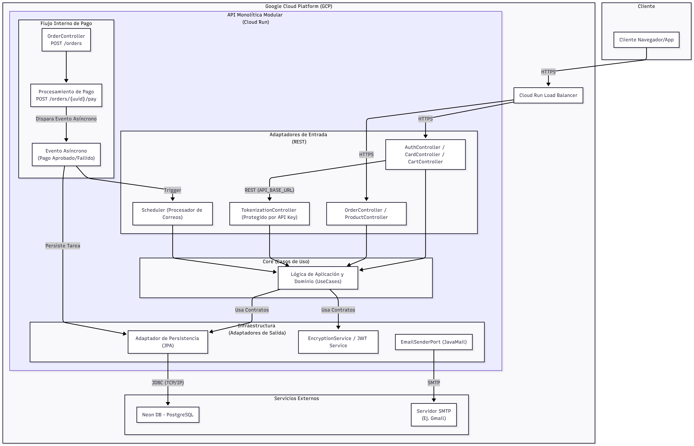
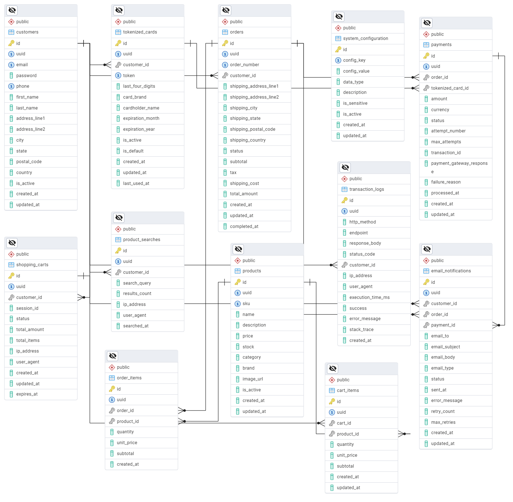

  README E-commerce API

Reto Técnico E-commerce (Java 21 & Spring Boot)
===============================================

Este repositorio contiene la API REST para un sistema de E-commerce, desarrollado como parte del reto técnico de Farmatodo. La API implementa una arquitectura hexagonal y cubre la gestión de clientes (con autenticación JWT), tokenización de tarjetas (protegida por API Key), gestión de carritos (para usuarios anónimos y registrados), un catálogo de productos, y un flujo completo de creación de órdenes y procesamiento de pagos.

El proyecto está configurado para despliegue continuo en **Google Cloud Run** a través de **GitHub Actions**.

| **Categoría**        | **Tecnología / Herramienta** | **Versión**         | **Descripción / Uso**                                         |
|-----------------------|------------------------------|---------------------|---------------------------------------------------------------|
| **Runtime**           | Java (Microsoft OpenJDK)     | 21                  | Entorno de ejecución principal.                               |
| **Framework**         | Spring Boot                  | 3.5.7               | Framework base para el backend.                               |
| **Base de Datos**     | PostgreSQL (Serverless, Neon)|  17                 | Base de datos relacional.                                     |
| **Migraciones**       | Flyway                       | —                   | Gestión de schema SQL versionado.                             |
| **Persistencia**      | Spring Data JPA              | —                   | Mapeo Objeto-Relacional (ORM).                                |
| **Seguridad**         | Spring Security              | —                   | Autenticación (JWT) y autorización.                           |
| **Tokenización**      | JJWT (`io.jsonwebtoken`)     | 0.12.3              | Creación y validación de JWT.                                 |
| **Documentación**     | Springdoc OpenAPI            | 2.6.0               | Generación de documentación (Swagger UI).                     |
| **Mapeo**             | MapStruct                    | 1.5.5.Final         | Mapeo entre DTOs, entidades y modelos.                        |
| **Utilidades**        | Lombok                       | —                   | Reducción de código boilerplate.                              |
| **Despliegue**        | Docker & Google Cloud Run    | —                   | Contenerización y despliegue serverless.                      |
| **CI/CD**             | GitHub Actions               | —                   | Integración y despliegue continuo.                            |

2\. Ejecución Local (Desarrollo con IntelliJ)
---------------------------------------------

Sigue estos pasos para ejecutar la API en tu máquina local.

### 1\. Prerrequisitos (Variables de Entorno)

Este proyecto requiere variables de entorno para funcionar, las cuales se leen desde `application-dev.yml`.

1.  **Clonar el Repositorio:**

        git clone https://github.com/JMTeixeira17/ecommerce-api-ft

2.  **Rellenar `application-dev.yml`:**
    *   Abre el proyecto en IntelliJ.
    *   Ve a `src/main/resources/application-dev.yml`.
    *   **`datasource`**: Añade tus credenciales de Neon (o cualquier base de datos PostgreSQL).
    *   **`spring.mail`**: Para que el envío de correos funcione, **debes usar una cuenta de Gmail**.
        *   Ve a la configuración de tu cuenta de Google -> Seguridad -> Verificación en 2 pasos.
        *   Genera una **"Contraseña de aplicación"** de 16 dígitos.
        *   Pega tu email en `spring.mail.username` y la contraseña de aplicación de 16 dígitos en `spring.mail.password`.
    *   **`security` y `api`**: Las claves de desarrollo ya están configuradas en el archivo.

### 2\. Pasos de Instalación y Ejecución

1.  **Abrir con IntelliJ IDE:**
    *   Abre IntelliJ y selecciona `File > Open...` y elige la carpeta `ecommerce-api` clonada.
2.  **Configurar el JDK:**
    *   Asegúrate de tener instalado **JDK 21** (recomendado: Microsoft OpenJDK 21).
    *   Ve a `File > Project Structure > Project` y asegúrate de que el SDK esté configurado en la versión 21.
3.  **Instalar Dependencias de Maven:**
    *   Espera a que IntelliJ indexe.
    *   Abre la pestaña **Maven** (usualmente en la derecha).
    *   Haz clic en `Lifecycle` -> `clean`.
    *   Haz clic en `Lifecycle` -> `install`. Esto descargará todas las dependencias del `pom.xml`.
4.  **Ejecutar la Aplicación:**
    *   Navega a `src/main/java/com/farmatodo/ecommerce/EcommerceApplication.java`.
    *   Haz clic en el icono de "play" (▶) verde junto a la clase `EcommerceApplication`.
    *   La API arrancará en `http://localhost:8080/api/v1`.
    *   La interfaz de Swagger estará disponible en: `http://localhost:8080/api/v1/swagger-ui.html`.

3\. Despliegue (Google Cloud Platform)
--------------------------------------

Este proyecto está configurado para despliegue en **Google Cloud Run** usando el `Dockerfile` y el pipeline de `GitHub Actions` provistos.

### 1\. Autenticación de Google Cloud CLI

(Requerido para el despliegue manual o la configuración inicial)

1.  **Instalar Google Cloud CLI:** [Sigue las instrucciones aquí](https://cloud.google.com/sdk/docs/install).
2.  **Autenticar tu cuenta:**
    
        gcloud auth login
    
3.  **Configurar tu proyecto:**
    
        gcloud config set project [TU-GCP-PROJECT-ID]
    
4.  **Habilitar las APIs necesarias:**
    
        gcloud services enable run.googleapis.com
        gcloud services enable artifactregistry.googleapis.com
        gcloud services enable secretmanager.googleapis.com
    

### 2\. Despliegue con Docker y Cloud Run

El `Dockerfile` en la raíz utiliza una **construcción multi-etapas** para crear una imagen de JRE 21 ligera y segura.

**Paso 1: Construir la Imagen Docker**

    # Formato: docker build -t gcr.io/[PROJECT-ID]/[SERVICE_NAME]:[TAG] .

**Paso 2: Subir la Imagen a Artifact Registry (o GCR)**

    # Autenticar Docker con GCP (si es necesario)
    gcloud auth configure-docker

    # Subir la imagen
    docker push gcr.io/[PROJECT-ID]/[SERVICE_NAME]:latest

**Paso 3: Desplegar en Cloud Run (Vía UI - Método Sencillo)**

1.  Ve a la consola de **Cloud Run** en GCP.
2.  Haz clic en **"Crear Servicio"**.
3.  Selecciona **"Implementar una revisión desde una imagen de contenedor existente"**.
4.  Haz clic en **"Seleccionar"** y elige la imagen `ecommerce-api:latest` que acabas de subir.
5.  Asigna un nombre al servicio (ej. `ecommerce-api`).
6.  Elige tu región (ej. `us-central1`).
7.  Permite las invocaciones **"Permitir todas"** (para que sea una API pública).
8.  **¡IMPORTANTE!** Ve a la pestaña **"Contenedores, volúmenes, redes y seguridad"**.
9.  En la sub-pestaña **"Variables y secretos"**, añade todas las variables de entorno que definimos en `application-prod.yml` (ej. `DB_URL`, `DB_PASSWORD`, `JWT_SECRET_KEY`, `API_KEY`, etc.). Para máxima seguridad, estos valores deben ser leídos desde **Secret Manager**.
10.  Haz clic en **"Crear"**.

**Paso 4: Desplegar en Cloud Run (Vía CLI - Método Avanzado)**

Este comando realiza el despliegue en un solo paso, asumiendo que los secretos ya están configurados en Secret Manager.

    # Este comando es un EJEMPLO de cómo se inyectan secretos
    gcloud run deploy ecommerce-api \
        --image gcr.io/cool-benefit-439020-e8/ecommerce-api:latest \
        --platform managed \
        --region us-central1 \
        --allow-unauthenticated \
        --set-secrets="DB_URL=DB_URL:latest,DB_USERNAME=DB_USERNAME:latest,DB_PASSWORD=DB_PASSWORD:latest,JWT_SECRET_KEY=JWT_SECRET_KEY:latest,API_SECRET_KEY=API_SECRET_KEY:latest,AES_KEY=AES_KEY:latest,AES_IV=AES_IV:latest,MAIL_HOST=MAIL_HOST:latest,MAIL_PORT=MAIL_PORT:latest,MAIL_USERNAME=MAIL_USERNAME:latest,MAIL_PASSWORD=MAIL_PASSWORD:latest,API_BASE_URL=API_BASE_URL:latest"

4\. Descripción del Sistema
---------------------------

### Arquitectura

El proyecto sigue una **Arquitectura Hexagonal (Puertos y Adaptadores)** para mantener una separación limpia de las responsabilidades:

*   **`domain`**: El núcleo del negocio. Contiene los modelos POJO (ej. `Customer`, `Order`), las excepciones de negocio (ej. `InsufficientStockException`) y los **Puertos** (interfaces, ej. `CustomerRepositoryPort`). Es 100% independiente de Spring.
*   **`application`**: La capa de orquestación. Contiene los **Casos de Uso** (`...UseCaseImpl`) que implementan la lógica de la aplicación (ej. `CreateOrderUseCaseImpl`). Depende del `domain` y es llamado por los adaptadores de entrada.
*   **`infrastructure`**: El "mundo exterior". Contiene:
    *   **Adaptadores de Entrada (Inbound):** `@RestController`s, `@RestControllerAdvice` (Manejador de Errores) y Tareas Programadas (`@Scheduled`).
    *   **Adaptadores de Salida (Outbound):** Implementaciones de los puertos (ej. `CustomerPersistenceAdapter` que usa Spring Data JPA, `JavaMailSenderAdapter` que usa Spring Mail).

### Autenticación

La API maneja tres niveles de acceso:

1.  **Público:** Endpoints que no requieren autenticación (ej. `/ping`, `/auth/login`, `/auth/register`, `/products/search`, `/cart/**`).
2.  **Autenticación de Cliente (JWT):** Endpoints que requieren un `Bearer Token` de JWT válido (ej. `/orders`, `/cards`).
3.  **Autenticación de Servicio (API Key):** Endpoints internos que requieren un header `X-API-KEY` (ej. `/tokenize`). El endpoint `/cards` requiere **ambos** (JWT y API Key).

### Diagramas

### Descripción de Tablas

*   **customers**: Almacena los datos del cliente, incluyendo dirección e información de contacto.
*   **tokenized\_cards**: Almacena los tokens de tarjeta (no datos sensibles), asociándolos a un cliente.
*   **products**: El catálogo de productos disponibles para la venta.
*   **product\_searches**: Log asíncrono de las búsquedas realizadas por los usuarios.
*   **shopping\_carts**: Almacena carritos activos para usuarios anónimos (por `session_id`) y registrados (por `customer_id`).
*   **cart\_items**: Tabla de unión que detalla qué productos y qué cantidad hay en cada carrito.
*   **orders**: El registro maestro de una orden, conteniendo el estado (`PENDING`, `PAID`, etc.), totales y dirección de envío.
*   **order\_items**: Detalle de los productos (cantidad y precio) comprados en una orden específica.
*   **payments**: Registro de los intentos de pago (exitosos o fallidos) asociados a una orden.
*   **transaction\_logs**: Log centralizado asíncrono de todas las peticiones a la API.
*   **email\_notifications**: Cola de emails para manejar envíos de correo con reintentos (ej. "Pago Fallido").
*   **system\_configuration**: Pares clave-valor para gestionar la lógica de negocio (ej. `payment.rejection.probability`) sin redesplegar.

5\. Pruebas y Colección de Postman
----------------------------------

### Pruebas Unitarias y de Integración

El proyecto está configurado con **Jacoco** para exigir un **80% de cobertura de código** pero solo se ejecutan las pruebas unitarias de UseCase y Controllers.

*   **Para ejecutar todos los tests (Unitarios y de Slice) localmente:**

        mvn clean test

*   **Para ejecutar un test específico en IntelliJ:**
    *   Abre un archivo de test (ej. `src/test/java/.../AuthControllerTest.java`).
    *   Haz clic derecho en el nombre de la clase y selecciona "Run 'AuthControllerTest'".

### Colección de Postman

El archivo `farmatodo-challenge.postman_collection.json` contiene la colección completa para probar la API (desplegada en GCP o localmente).

1.  Abre Postman y haz clic en `Import`.
2.  Sube el archivo `.json`.
3.  La colección utiliza variables (ej. `{{base_url}}`, `{{jwt_token}}`, `{{card_uuid}}`).
4.  **Flujo de Prueba:**
    1.  Ejecuta `3. Login Cliente` (el script de "Tests" guarda el `{{jwt_token}}`).
    2.  Ejecuta `4. Registrar Tarjeta` (el script de "Tests" guarda el `{{card_uuid}}`).
    3.  Ejecuta `8. [Autenticado] Añadir Producto al Carrito`.
    4.  Ejecuta `9. [Autenticado] Crear Orden desde Carrito` (usa el `{{card_uuid}}` y guarda el `{{order_uuid}}`).
    5.  Ejecuta `10. [Autenticado] Procesar Pago de Orden` (usa el `{{order_uuid}}`).
5. **Flujo adicional:**
    1. En la carpeta `Administración (Config)` tendrás las rutas para modificar los parametros como:
        1. Probabilidad de rechazo de tokenización de tarjeta.
        2. Actualizar stock mínimo visible de productos.
        3. Actualizar probabilidad de rechazo de pago.
        4. Actualizar cantidad de intentos de pago.
6\. Documentación IA
--------------------

_(Sección de prompts requerida por el reto)_

Este proyecto se desarrolló con la asistencia de tres modelos de Inteligencia Artificial (Gemini, Claude y ChatGPT) quienes actuaron como "Ingeniero de Software Senior". El flujo de desarrollo fue iterativo, depurando y refactorizando el código en colaboración.

Además se utilizó "NotebookLM" para:
- Procesar la información contenida en el documento inicial de prueba técnica.
- Generación de prompts utilizando documentación de expertos en la generación de prompts (Ej. Effective Prompt Engineering Practices - Google)

También se usó como guía de ayuda: https://cloud.google.com/discover/what-is-prompt-engineering?hl=es_419

**Prompts clave utilizados:**

*   "Eres un Backend Engineer Senior, especializado en Java y me ayudaras a crear un eCommerce... Analiza y verifica que el esquema que te estoy proporcionando cumple con todos los criterios del archivo adjunto."
*   "Vamos a implementar la tokenización de tarjetas. Un cliente debe poder registrar tarjetas... La forma en como pensé este endpoint es la siguiente: El usuario debe estar autenticado para registrar una tarjeta. Si esto es válido, se llamára a un endpoint interno que utiliza la APIKEY para ejecutar el servicio de tokenización."
*   Actúa como un arquitecto de software y Backend Engineer en Java y Spring Boot 3. Necesito que me ayudes en la toma de decisiones para la arquitectura, como la base de datos y las decisiones óptimas para que el sistema funcione de forma óptima y eficiente.Usaremos Java 21 con Maven. Además para la base de datos usaremos PostgreSQL.Empecemos por las bases y definamos la base de datos que cumpla con los requisitos del proyecto.

Link de acceso al chat de Gemini: https://gemini.google.com/share/e889d4bf0bab
